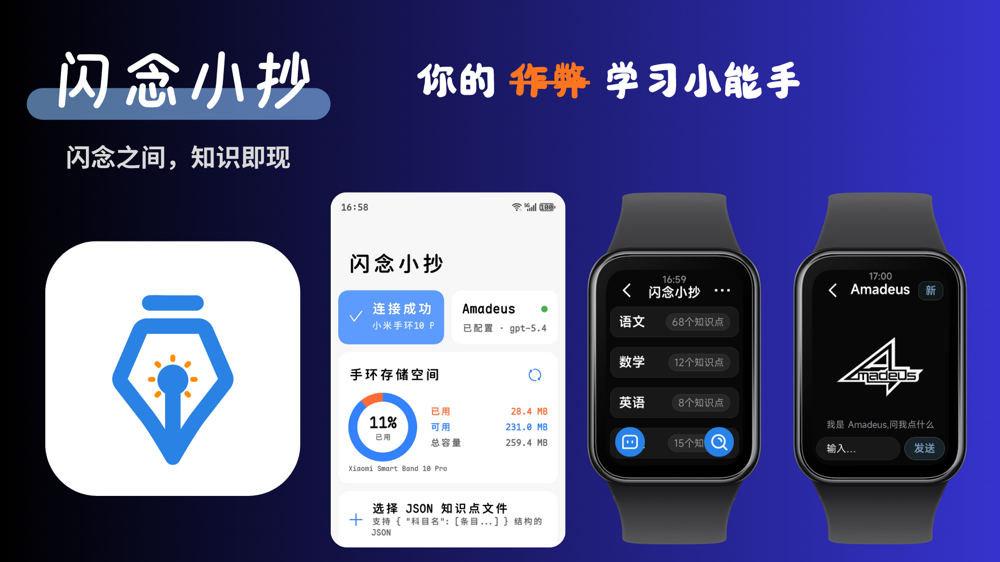

# 闪念小抄

把零散的知识点装进小米手环，随时随地抬腕就看。

闪念小抄是一套「手机 + 手环」配合的小工具：在手机上整理你的知识小抄，一键推到手环；之后无需掏手机，抬腕即可离线翻阅。背单词、记考点、备台词、放备忘——凡是「想随时瞄一眼」的内容，都可以搬上手腕。

## 它能做什么

**手机端（闪念小抄 App）[去下载](https://github.com/WenHuaYiYang/Snapnotes-andriod/releases/tag/stable)**

- **编辑器**：在手机上编写、整理你的知识点 JSON，分科目分条目管理。
- **内置文件管理器**：直接浏览本机 JSON 文件，也支持从微信 / QQ / 文件管理器「打开方式 → 闪念小抄」推送。
- **一键推送**：勾选内容推送到已连接的手环，进度通知实时可见，传输稳、断点可续。
- **推送历史**：按时间回看推过什么，可单条删、批量清，本机缓存与手环端导入内容分离管理。
- **连接助手**：实时显示手环连接状态，断开自动重连；连接异常时进排障页，三步引导自助恢复。
- **AI 助手（Amadeus）能力已备**：手机端可配置 LLM 接口（Base URL / API Key / Model），内置上下文管理菜单查看会话、本地测试发送、导出最近回复；手环端聊天界面上线后即可抬腕问答。

**手环端（小米穿戴快应用）[去下载](https://github.com/WenHuaYiYang/Snapnotes-band/releases/tag/stable)**

- **学科 / 知识点浏览**：抬腕按学科翻看知识点，长标题滚动展示，导入科目有角标。
- **搜索**：在手环上直接搜索知识点标题，快速定位要复习的那一条。
- **详情阅读**：点开看完整内容，专为小屏优化的排版。
- **自带输入法**：内置手环端输入组件，无需依赖系统输入法即可在手表上输入。
- **导入页**：接收手机推送，并入即活、即时可见，全程状态可见。

## 适合谁

- 备考党：把易忘考点压到手腕上，碎片时间抬腕刷两条。
- 语言学习者：单词卡随身，通勤路上抽空过一遍。
- 内容创作者：台词、要点、提纲随身带，彩排时瞄一眼就能接上。
- 任何想「抬腕即查」的人：把你的小抄装到最方便看的位置。

## 一句话

手机整理知识，手环随身翻阅——闪念小抄让你的小抄真正「抬手可得」。

## 支持作者

如果你觉得这个小工具对你有帮助，欢迎请作者喝杯咖啡 ☕

| 微信 | 支付宝 |
|------|--------|
|  |  |

[作者的爱发电](https://ifdian.net/a/snapnotes)
